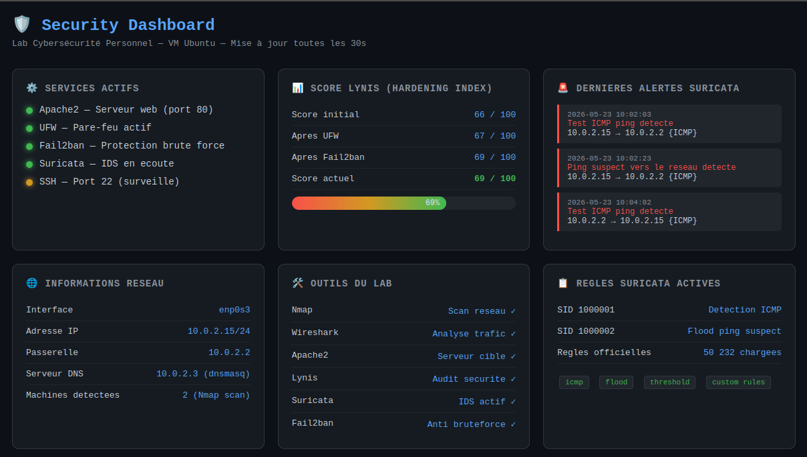

# Lab Cybersécurité Personnel

> Environnement de test complet sur VM Ubuntu — outils professionnels de surveillance, audit et détection d'intrusion.

---

## Outils utilisés

| Outil | Rôle |
|-------|------|
| Nmap | Scan et cartographie réseau |
| Wireshark | Analyse de trafic en temps réel |
| Apache2 | Serveur web cible pour les tests |
| Lynis | Audit de sécurité système |
| Suricata | Détection d'intrusion (IDS) |
| UFW | Pare-feu |
| Fail2ban | Protection contre le brute force |

---

## Ce que j'ai fait

### 1. Scan réseau avec Nmap
- Scanné le réseau local 10.0.2.0/24
- Détecté 2 machines : la passerelle (10.0.2.2) et un serveur DNS dnsmasq (10.0.2.3)
- Installé Apache2 et détecté le port 80 ouvert avec la version du serveur

### 2. Analyse de trafic avec Wireshark
- Capturé du trafic DNS et HTTP en temps réel
- Observé les requêtes DNS vers le serveur DNS détecté avec Nmap

### 3. Audit de sécurité avec Lynis
- Score initial : 66/100
- Correction 1 : activation du pare-feu UFW → 67/100
- Correction 2 : installation de fail2ban → 69/100
- Correction 3 : mises à jour automatiques de sécurité

### 4. Détection d'intrusion avec Suricata
- Installé et configuré Suricata sur l'interface réseau
- Créé des règles de détection personnalisées
- Règle 1 : détection de tout trafic ICMP
- Règle 2 : détection de flood ping suspect (3 pings en 2 secondes)
- Généré des alertes en temps réel avec horodatage, IP source et destination

### 5. Dashboard de monitoring
- Créé une page web hébergée sur Apache
- Centralise l'état des services, les alertes Suricata et le score Lynis
- Interface visuelle type SOC

---

## Ce que j'ai appris
- Cartographier un réseau et identifier les services exposés
- Analyser le trafic réseau et détecter des anomalies
- Auditer et durcir un système Linux
- Écrire des règles de détection IDS personnalisées
- Faire le lien entre attaque et défense
